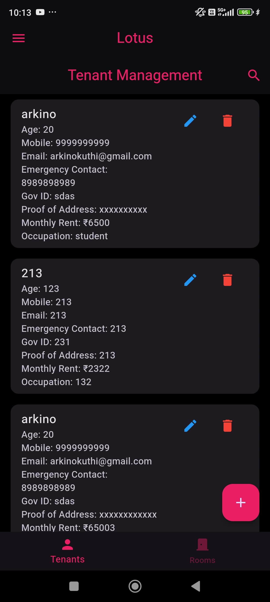
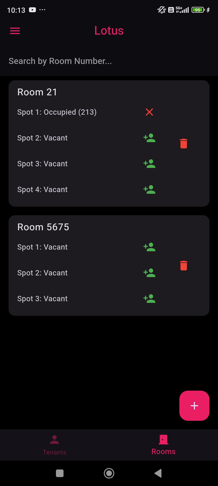
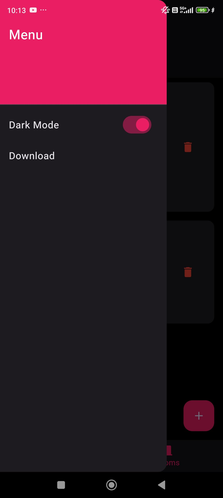
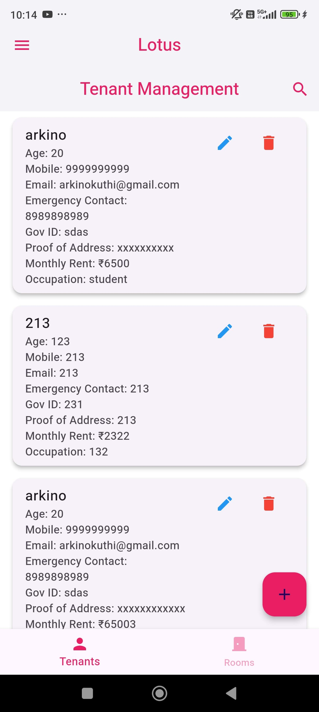
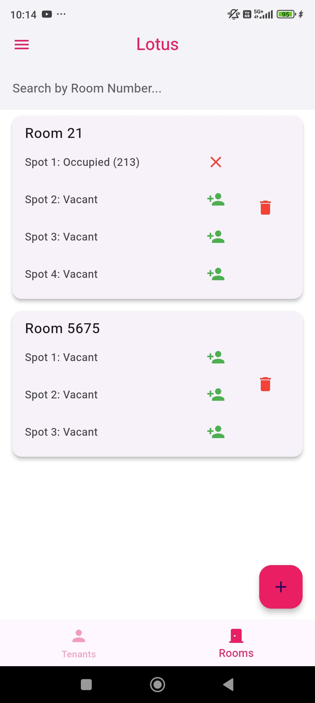
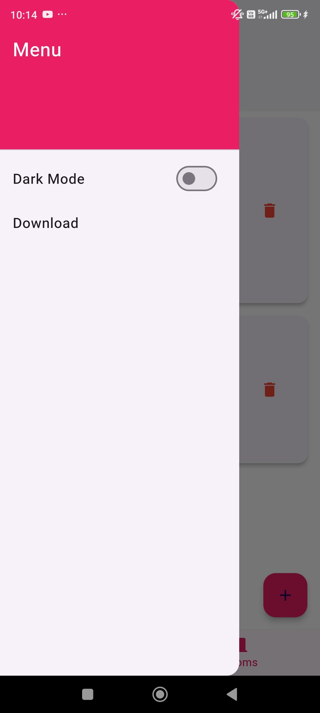

🌸 Lotus App

A Flutter application for managing tenants and rooms efficiently.

✨ Features

✅ Tenant Management – Add, edit, delete, and search for tenants.
✅ Room Management – Assign and unassign tenants to rooms.
✅ Search Functionality – Quickly find tenants and rooms using a built-in search feature.
✅ Dark Mode Support – Seamless switching between light and dark themes.
✅ Export to CSV – Download tenant data as a CSV file (Windows support).

📸 Screenshots

### DARK MODE

  
  
  

### LIGHT MODE

  
  
  

